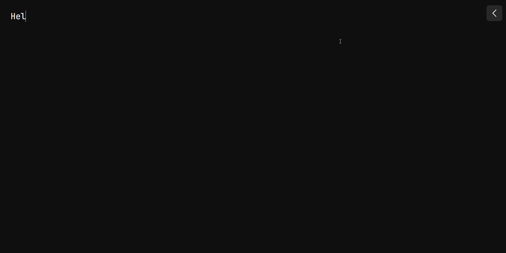

# Notepad

Made this because sometimes I want to write down some notes in the Steam overlay while playing games and didn't find an online notepad that I liked.

## Features

-  Local storage auto save & load
-  Dark & light theme support
-  Editor width toggle
-  Font
   -  Resizing
   -  Custom font option
   -  A decent default font (JetBrains Mono)

## Preview

